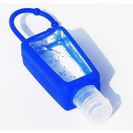
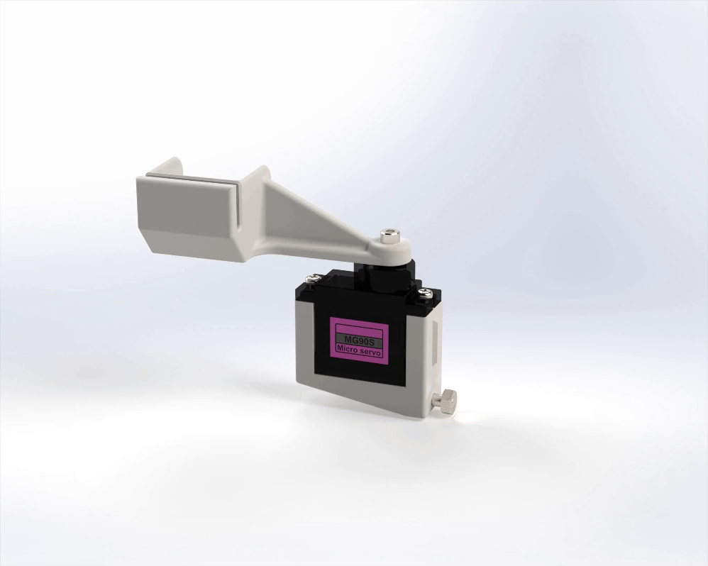
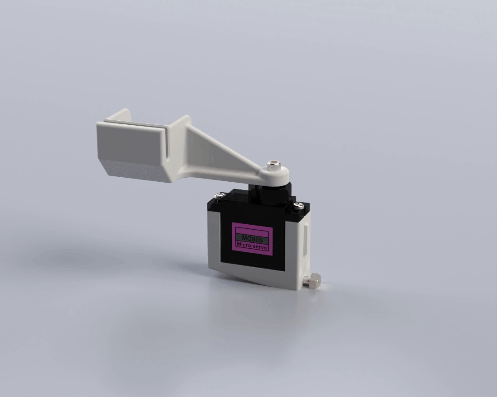

# V0.2_Nozzle_Wiper
Nozzle wiper for purging and cleaning the nozzle of a Voron V0.2. Inspire from the work of [chirpy](https://mods.vorondesign.com/details/xHsmitgNkpdeQ3tpHImI6A "chirpy").

[Nozzle wiper for purging and cleaning the nozzle of a Voron V0.2](https://youtu.be/P-DkkuqNvOA "Nozzle wiper for purging and cleaning the nozzle of a Voron V0.2")

**BOM:**

- 1x Micro Servo 9G Servo Motor (SG90/MG90)
- 1x M3x10mm BHCS
- 1x M2.5x8mm SHCS
- 2x M2x10mm self-tapping screws
- A thin piece of silicone*

*I used a piece of casing for antibacterial gel bottles

**Code**

- I modified the chirpy configuration file to make it more suitable for this design.
- You will need to calibrate the routine with the specific values for your printer. The instructions are in the configuration file.
- I also recommend modifying your homing and print start macros for the best integration.

**Renders**

 "Spin")
